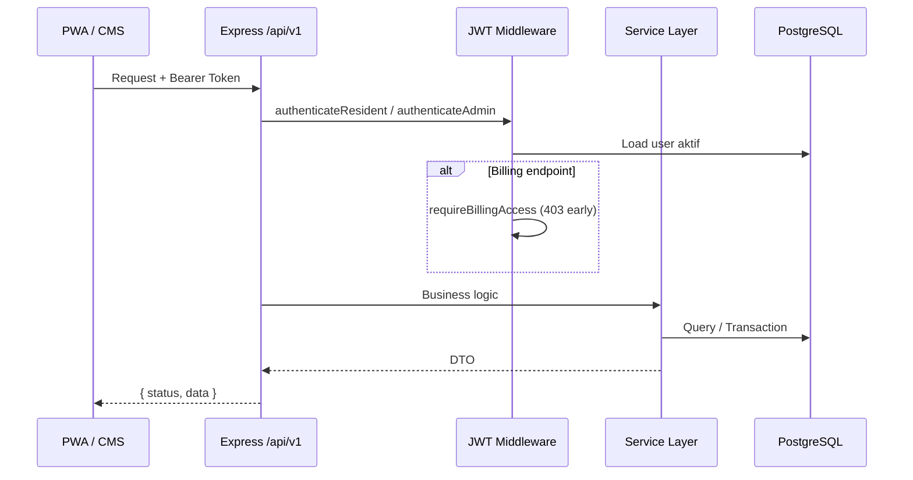

# Arsitektur API Warga App

## Stack yang dipilih

- **Node.js + Express + TypeScript** — selaras dengan frontend `web/` dan `cms/`
- **PostgreSQL** — relasi kuat (NIK/KK, tagihan per KK, audit log)

Implementasi boilerplate: folder [`/api`](../api).

## Diagram alur request



## Model data inti

| Entitas | Kunci | Catatan |
|---------|-------|---------|
| `residents` | NIK (16), `no_kk` | `is_parent` → wali; `can_view_billing` gate IPL |
| `billings` | `no_kk` + `period_id` | Status: unpaid / pending / paid |
| `payment_proofs` | → billing | Antrean approval CMS |
| `home_menu_items` | `menu_key` | Urutan menu depan (CMS) |
| `news_articles` | `slug` | `is_priority` untuk hero |
| `umkm_shops` | UUID | Jam buka → hitung `is_open` di server |
| `admins` | email | RBAC: super / finance / content |
| `audit_logs` | — | Aktivitas admin |

## Aturan bisnis penting

1. **Masking profil** — 6 digit awal + `******` + 4 digit akhir (NIK & KK).
2. **Satu wali per KK** — partial unique index `uq_one_parent_per_kk`.
3. **Pindah wali** — update admin mencabut `is_parent` pada anggota lain di KK sama.
4. **Soft delete warga** — `status = inactive`; wali tidak boleh di-nonaktifkan tanpa pengganti.
5. **Berita** — `ORDER BY is_priority DESC, published_at DESC`.

## Integrasi frontend

Set di `web/.env`:

```
VITE_API_BASE_URL=http://localhost:3000/api/v1
```

Gunakan helper [`web/src/api/client.ts`](../web/src/api/client.ts) dengan header `Authorization: Bearer …`.
